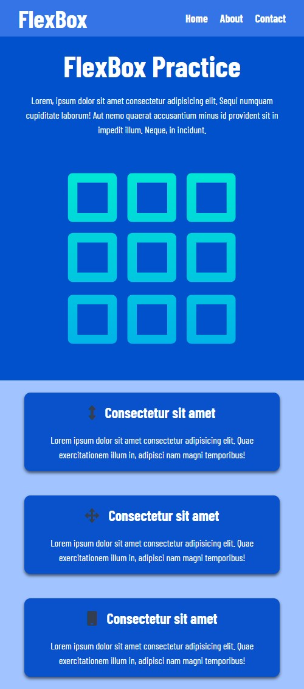

# About the Site

I build this site while recapping CSS Flexbox. I was watching Brad Traversy side by side as he was coding in the video. 

I have learnt a few techniques and/or properties that will make my coding css and html easier.  

I am going to work more to highlight my Flexbox skills. 
I find Flex box very interesting. Am so elated that I now have the knowledge of Css Flexbox in full.

Here is how the page looks on different views;

# The Desktop View:

# The Mobile View:

